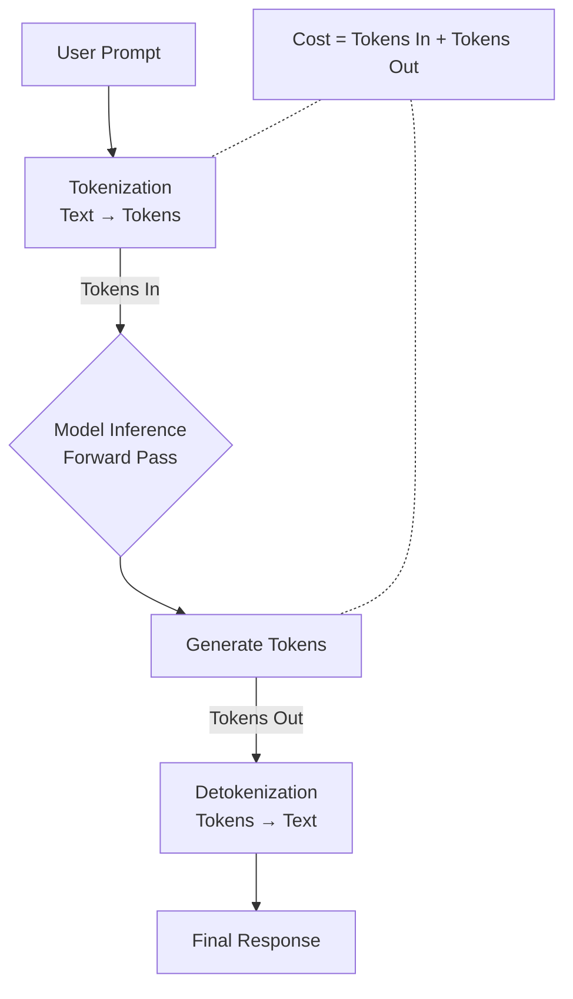
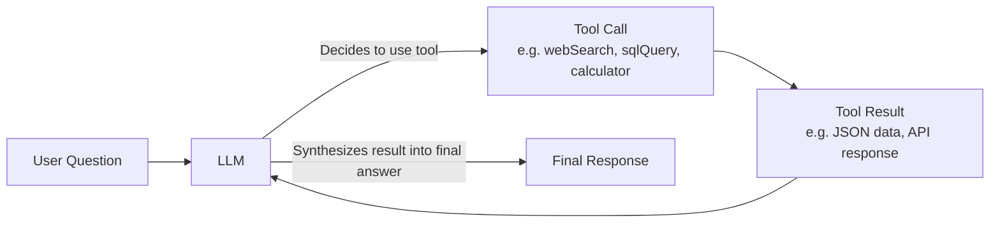
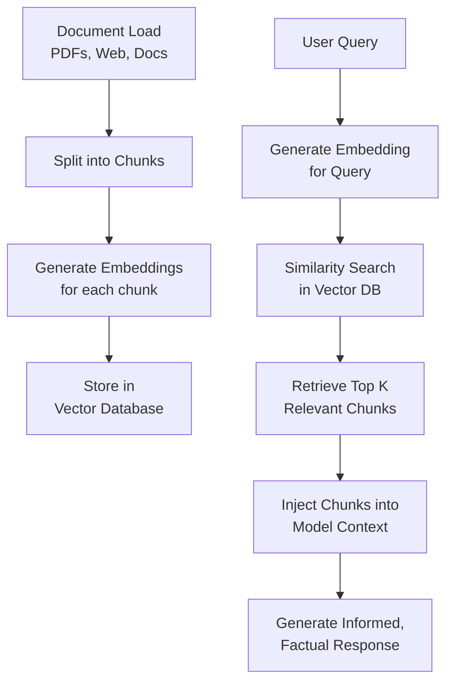

# GenAI Learning

This repository contains resources, experiments, and notes for learning **Generative AI (GenAI)** with a focus on **LLMs, tools, and RAG**.

---

## 🚀 Getting Started

1. Clone the repository.
2. Install dependencies (`npm install` / `yarn install`).
3. Set up environment variables (e.g. `GROQ_API_KEY`, model name).
4. Run examples to experiment.

---

## ✨ Features

- Example GenAI chat completions
- Using tools (e.g. web search, PDF parsing)
- Retrieval-Augmented Generation (RAG) basics
- Tutorials, notes, and experiments
- Learnings on prompt engineering & message roles

---

## 📚 Learnings & Notes

### 1. Core Concepts

#### 📌 Model Fundamentals

| Concept         | Description                                                        | Key Insight                                                                 |
|-----------------|--------------------------------------------------------------------|-----------------------------------------------------------------------------|
| **Parameter**   | Internal weights of the model.                                     | LLaMA-3 = 8B–405B parameters. More parameters = more capability but higher cost. |
| **Token**       | Smallest unit of text processed (word or sub-word).                | Cost = **Tokens In (prompt)** + **Tokens Out (response)**.                  |
| **Context Window** | Maximum number of tokens a model can process in one request.       | GPT-4 Turbo = 128k tokens (~300 pages). Larger windows allow more history/data. |
| **Embeddings**  | Numerical vector representations of text capturing semantic meaning. | Used for **search, RAG, clustering, similarity comparison**.                 |

---

#### ⚡ Inference & Cost Flow

The process of generating a response and calculating its cost:



#### 🎛️ Controlling Output

Temperature → Controls randomness of output.

0 = Deterministic, repetitive (best for fact-based tasks).

0.7 – 1.0 = Creative, diverse (best for storytelling, brainstorming).

Top-k / Top-p (Nucleus Sampling) →
Alternative sampling strategies that influence how the next token is picked:

Top-k: Pick from the k most likely tokens.

Top-p: Pick from the smallest set of tokens whose probabilities sum to p.
✅ Improves quality and diversity of responses.

### 2. Message Roles in Chat Models

When working with LLMs (Groq, OpenAI, Anthropic, etc.), messages follow structured **roles**:

- **system** → Defines behavior, tone, style, rules.  
  Example: `"You are a precise assistant that only returns numbers."`
- **user** → Human input.  
  Example: `"What is the gold rate in India as of Aug 2025?"`
- **assistant** → Model response.  
  Example: `"The current gold rate is ₹XX,XXX per 10 grams."`
- **tool / function_call** → Structured request for an external tool/API.  
  Example: `{"name": "webSearch", "arguments": {"query": "24K gold price India"}}`
- **tool_result / function_result** → Data returned from the tool.  
  Example: Search results JSON, database query response.

This structured flow allows **multi-turn reasoning** + integration with **external data**.

---

### 3. Prompt Engineering Best Practices

- Be **clear and specific**:  
  `"Return only the 24K gold price in India per 10 grams (August 2025). Do not expand."`
- Add **formatting constraints**:  
  `"Answer in JSON with 'price' field only."`
- Use **system prompts** to enforce rules (style, depth, safety).
- Chain prompts → Model can refine earlier tool results.

---

### 4. Tool Use (Function Calling)

Tools extend LLMs with external capabilities. Example flow:

1. User asks → `"Give me the gold rate in India (Aug 2025)."`
2. LLM decides to call `webSearchTool`.
3. Tool returns structured results.
4. LLM **reprocesses results** to give final refined answer.



**Implementation Pattern**:

```js
const response = await groq.chat.completions.create({
  model: "openai/gpt-oss-120b",
  messages: [{ role: "user", content: userInput }],
  tools: [webSearchTool],
  tool_choice: "auto"
});
```

---

### 5. Tokens, Context & Inference

* **Token** → The smallest text unit processed by a model.  
  Example: `"ChatGPT is smart"` → `["Chat", "G", "PT", " is", " smart"]`.

* **Context** → All information given to the model (conversation history, system instructions, tool outputs).

* **Context Window** → Max tokens the model can “see” at once.  
  Example: GPT-4 Turbo = 128k tokens (~300 pages).

* **Inference** → Running the model to generate output from tokens + context.  
  You pay for **tokens in (prompt)** + **tokens out (response)**.

---

### 6. Prompting Paradigms

* **Zero-shot prompting** → No examples.  
  `"Translate 'How are you?' into French."`

* **One-shot prompting** → One example.  
  `"English → French. 'Good morning' → 'Bonjour'. Now translate 'How are you?'"`

* **Few-shot prompting** → Multiple examples to guide the model.

* **Chain-of-Thought (CoT)** → Ask model to reason step by step.  
  `"Think step by step: What is 24 × 17?"`

* **Self-consistency** → Generate multiple reasoning paths and pick the most common answer.

---

### 7. 🔑 Key Model Concepts

#### 📐 Parameters
- **Definition**: Internal weights that define the model’s knowledge.  
- **Scale**: Modern LLMs have **billions of parameters**.  
- **Example**: LLaMA-3 ranges from **8B → 405B parameters**.  
- **Insight**:  
  - More parameters → higher capability (better reasoning, richer knowledge).  
  - But also → more compute cost, memory usage, and slower inference.  

---

#### 🌡️ Temperature
- **Definition**: Controls the *randomness* of token selection.  
- **Range**: `0 → 2` (most APIs).  
- **Examples**:  
  - `0` → **deterministic & repetitive** (good for facts, coding, math).  
  - `0.7–1.0` → **creative & diverse** (good for storytelling, brainstorming).  
  - `>1.5` → often incoherent.  
- **Rule of Thumb**:  
  > Lower = precision. Higher = imagination.  

---

#### 🎲 Top-k & Top-p (Nucleus Sampling)
- **Purpose**: Alternative sampling strategies for better quality + diversity.  
- **Top-k**: Choose the next token from the *k* most likely tokens.  
  - Example: `k=50` → model considers 50 most probable tokens.  
- **Top-p**: Choose from the *smallest probability mass p*.  
  - Example: `p=0.9` → model considers tokens whose combined probability ≥ 90%.  
- **When to Use**:  
  - `Top-k` = tighter control.  
  - `Top-p` = more natural, adaptive outputs.  
- Often combined with **Temperature** for fine control.  

---

#### 🧩 Embeddings
- **Definition**: Numeric vector representation of text that captures **semantic meaning**.  
- **Usage**:  
  - 🔍 Search / semantic retrieval.  
  - 📚 RAG (Retrieve-Augment-Generate).  
  - 🧠 Clustering & classification.  
  - 🔗 Similarity comparison.  
- **Example**:  
  - `"dog"` and `"puppy"` → vectors close in space.  
  - `"dog"` and `"car"` → vectors far apart.  

---

#### 🚨 Hallucinations
- **Definition**: When the model produces a **confident but false / nonsensical answer**.  
- **Why it happens**:  
  - Trained to predict patterns, not verify truth.  
  - Limited context window.  
  - Gaps in training data.  
- **Mitigations**:  
  - ✅ **RAG** → Ground responses in real data.  
  - 🔧 **Tool usage** → APIs, DBs, calculators for factual answers.  
  - 🔍 **Fact-checking layers** → Post-processing with validation.  
  - 📉 **Lower temperature** → Reduces “creative” hallucinations.  


---

### 7. Retrieval-Augmented Generation (RAG)

LLMs don’t know everything → RAG adds **external knowledge**.

1. Convert documents into **embeddings**.
2. Store in **vector DB** (Pinecone, Weaviate, FAISS).
3. On query, retrieve relevant chunks.
4. Inject chunks into model’s **context window**.

This keeps answers **up-to-date** + reduces **hallucinations**.

**The RAG Process Flow:**



**Components:**

* **Vector Database:** Pinecone, Weaviate, PGVector, FAISS.  
* **Embedding Models:** OpenAI `text-embedding-3-small`, BGE, E5.

---

### 8. Advanced Usage

* **Prompting vs Fine-tuning**  
  - Prompting = instructions only.  
  - Fine-tuning = adjusting weights for domain tasks.

* **LoRA / PEFT** → Efficient fine-tuning methods.  
* **Inference optimizations** → Quantization, batching, streaming.  
* **Latency factors** → Model size, hardware, context length, network.
